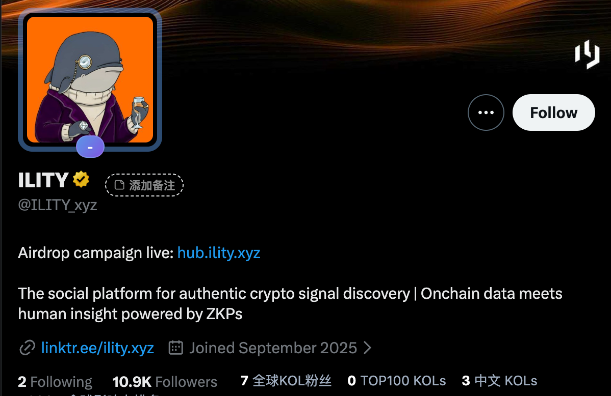
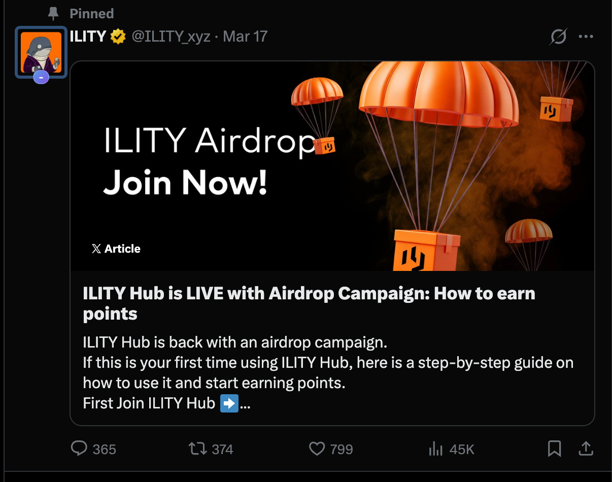
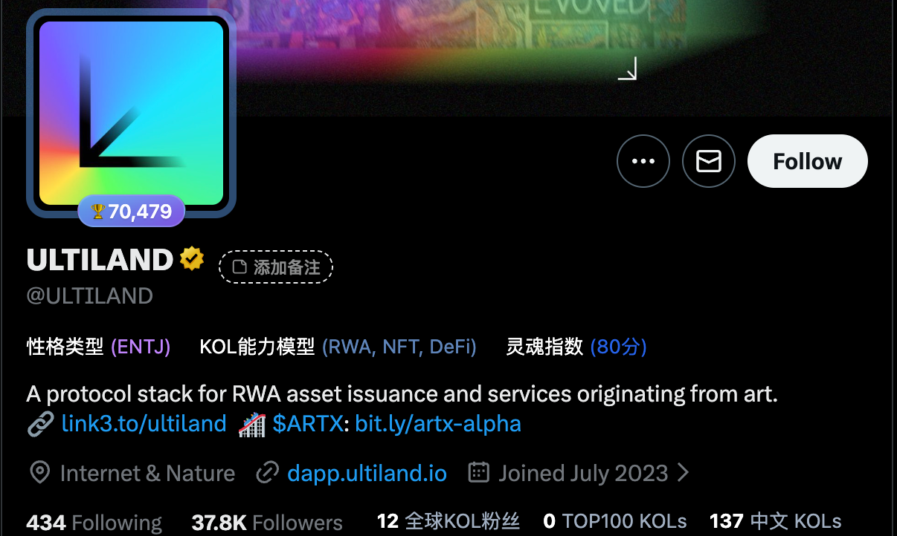
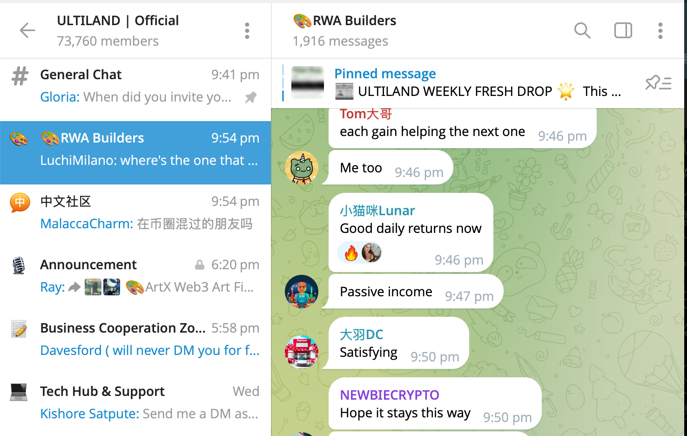
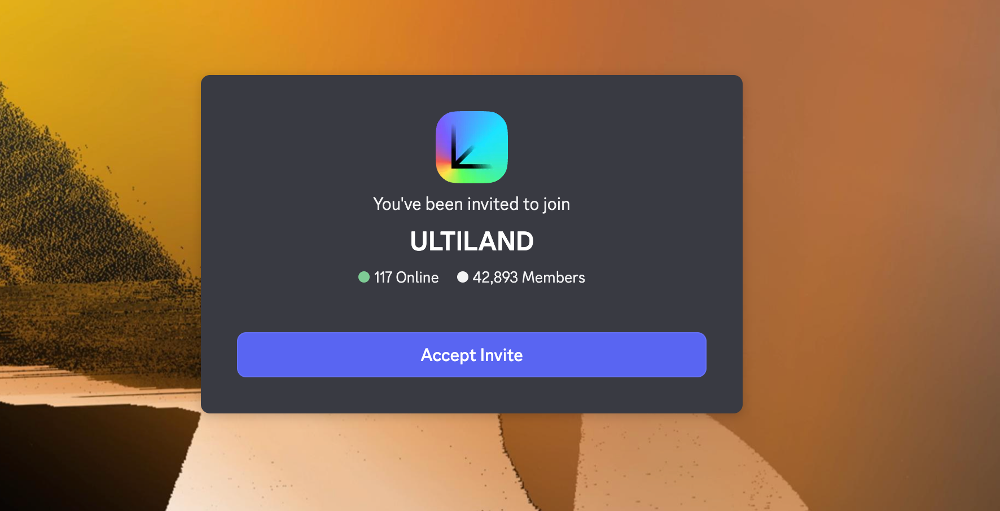
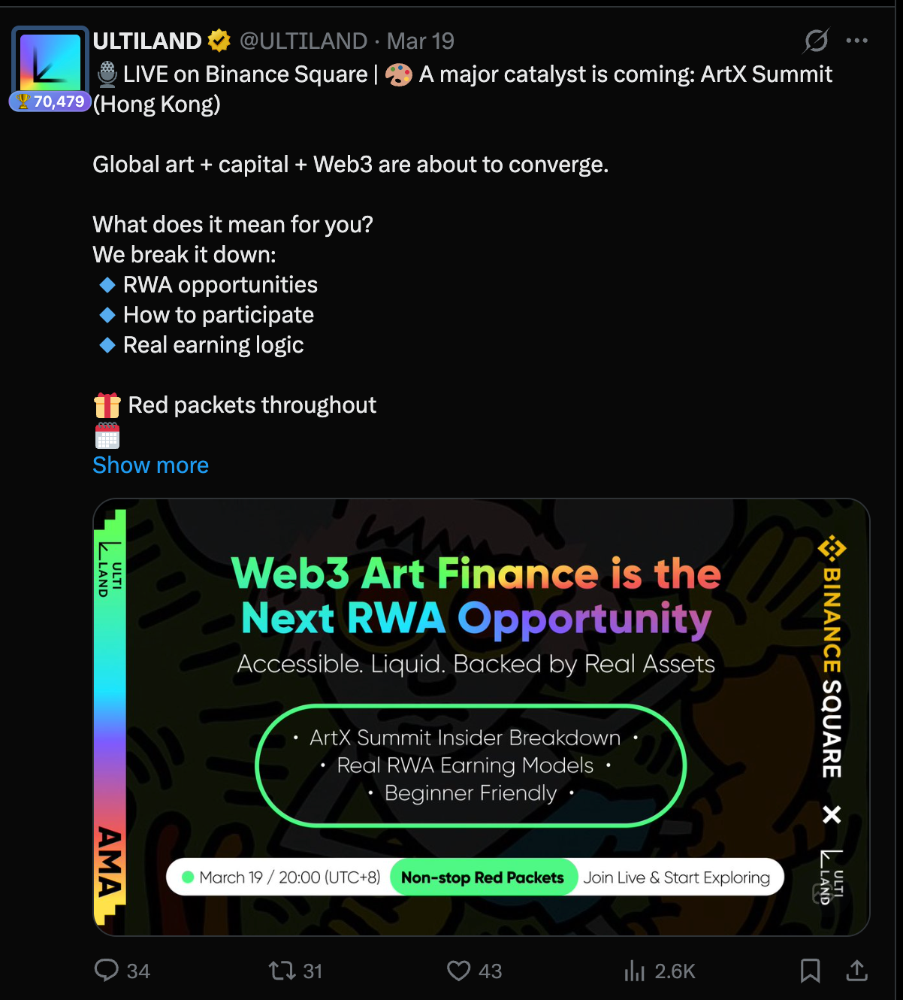
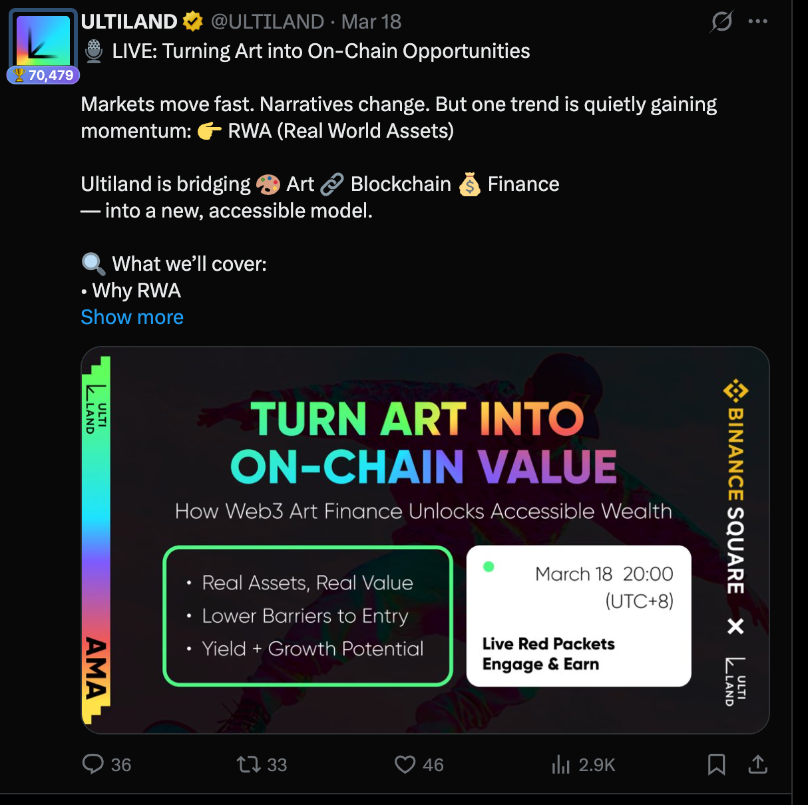
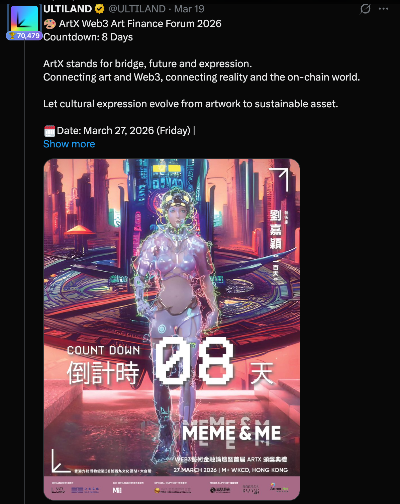

# ILITY vs. ARTX (Ultiland) CEX Listing Data Comparison & Gap Analysis

## 1. Core Data Comparison (Real-time vs. Target)

| Metric                           | **ILITY (@ILITY_xyz)** | **ARTX (ULTILAND)**          | **Bitget Estimated Threshold / Recommendation** | **Gap / Status**                             |
| :------------------------------- | :--------------------------- | :--------------------------------- | :---------------------------------------------------- | :------------------------------------------------- |
| **Twitter Followers**      | **10.9K**              | **37.8K**                    | 30K - 50K                                             | **Gap ~20K-40K**                             |
| **TG Members**             | **10.8K**              | **73.7K**                    | 50K+                                                  | **Gap ~60K**                                 |
| **Discord Members**        | **8.3K**               | **42.9K**                    | 30K+                                                  | Insufficient member count                          |
| **Weekly Activity**        | Low                          | High                               | 1,000+ Daily Messages                                 | **Core Pain Point: Lack of real discussion** |
| **Primary Campaign Types** | Points-based Hub, Zealy      | **Binance Square Live**, AMA | Diversified external endorsements                     | Lack of high-volume external exposure              |

### 🔍 Social Data Screenshots

#### **ILITY Data Status (Growth Needed)**

#### **ARTX Benchmark Data (Bitget Listed Project)**

---

## 2. ARTX Success Path Analysis

### 📈 Campaigns & Endorsements

**Key Takeaways:**

1. **High-Frequency Value Incentives**: Rapidly boost social media engagement (Likes/RTs) through USDT giveaways.
2. **Top-Tier Platform Endorsements**: **Binance Square Live** sessions are a critical bonus for listing reviews.
3. **Multi-Dimensional Distribution**: Utilize platforms like Galxe/TaskOn for massive traffic inflow.

---

## 3. Growth Proposals for ILITY (Bitget Listing Readiness)

To meet Bitget’s rigorous review standards, the following activities are recommended in order of priority:

### Priority 1: Top-Tier Platform Live Sessions & AMA with Renowned Projects (High-Impact AMA)

- **Proposed Plan**:
  1. **Binance Square Live & Bitget Live**: Apply for official live slots and invite leading ZK track figures or founders of top SocialFi projects for dialogues.
  2. **Joint AMAs**: Hold joint AMAs with already-listed renowned projects (e.g., ARTX, Polyhedra).
- **Detailed Execution**:
  - Theme: "How ZK Privacy Protects the Dignity of Social Assets."
  - During the live sessions, set "Hub Exclusive Airdrop Codes" to guide the audience from the Binance/Bitget traffic pool into the ILITY Hub via code verification.
  - Leverage retweets from renowned project accounts to achieve precise "crypto native" traffic injection.

### Priority 2: Regional Community Building (Regional Expansion - Telegram Topic)

- **Proposed Plan**: Formally establish **ILITY VIETNAM** and **ILITY TURKEY** regional secondary groups using the **Telegram Topics** model.
- **Detailed Execution**:
  - **Topics Architecture**: Enable the Topics feature in the main group, subdivided into `#General`, `#News`, `#Vietnam`, `#Turkey`, etc.
  - **Localized Operations**: Hire local community leaders to publish localized news daily and mandate discussion activity under specific Topics.
  - **Goal**: Prove to CEXs that ILITY has a real and well-organized active following in core crypto regions (Southeast Asia, Middle East), rather than just "zombie" followers.

### Priority 3: Community Intelligence Maintenance Plan (Artificial Intervention)

- **Objective**: Address the awkwardness of silent groups or those filled with bots.
- **Detailed Execution**:
  - **Ambassador Program**: Recruit 15 "Community Ambassadors" covering global time zones in three shifts.
  - **Topic Guidance**: Ambassadors won't just say "GM"; instead, the operations team will provide 5-10 deep topics daily (e.g., comparing ZK solutions, discussing future Hub point utilities).
  - **Steady Engagement**: During the Bitget review period (usually 1-2 weeks), ensure real, substantive discussions happen every 10 minutes to create a vibe of "spontaneous community discussion about products and market trends."

### Other Growth Tactics:

- **Viral Social Growth**: Launch a "Privacy Link" campaign; sharing invitation links to a specific number of major crypto groups earns Hub premium boosts.
- **On-Chain Privacy Tasks**: Release ZK tasks on the Hub that require specific on-chain balances (e.g., holding 0.1 ETH) for verification, boosting on-chain activity.

---

## 4. Timeline & Milestones

Based on current data and listing goals, a three-phase "stepping-stone" strategy is recommended:

### Phase 1: Incubation & Viral Growth (March 20 - April 20)

- **Core Goal**: Meet **MEXC** listing standards.
- **Key Actions**:
  - Launch large-scale Airdrop Campaigns to attract real users via the Hub.
  - Achieve exponential growth in tweet engagement and community member count.
  - **Around April 20**: Coordinate with MEXC for listing and complete liquidity pool setup.

### Phase 2: Pre-Market Heat & Interaction Boost (April 20 - Early May)

- **Core Goal**: Launch on **Bitget Onchain** section.
- **Key Actions**:
  - Debut in the Bitget Onchain (pre-market spot) section to tap into Bitget’s traffic pool.
  - **Interaction Boost**: Focus on the ILITY Airdrop Program to drive high numbers of deep on-chain interactions.
  - Maintain high-frequency community discussions to ensure the Bitget team sees real community vitality during the "observation period."

### Phase 3: Bitget Spot Official Listing (Second Week of May)

- **Core Goal**: Complete **Bitget Spot** listing.
- **Key Actions**:
  - Summarize data growth from the first two phases (including MEXC trading data, Onchain interaction data, and social activity).
  - Utilize final pre-listing sprint activities (e.g., Launchpad or joint staking) to reach peak brand awareness.

---

**Summary**: ILITY’s path to success is clear—conquer MEXC through **one month of incubation**, warm up traffic via **Bitget Onchain**, and ultimately achieve the **Bitget Spot** goal in the **second week of May**.
