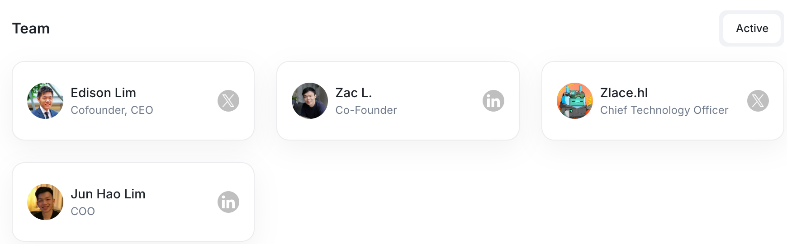
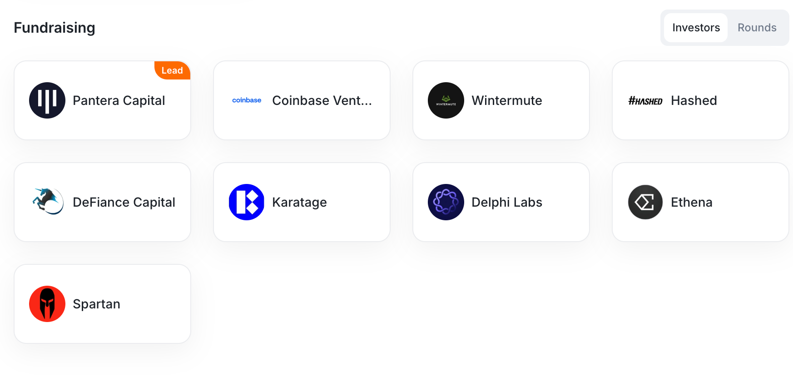
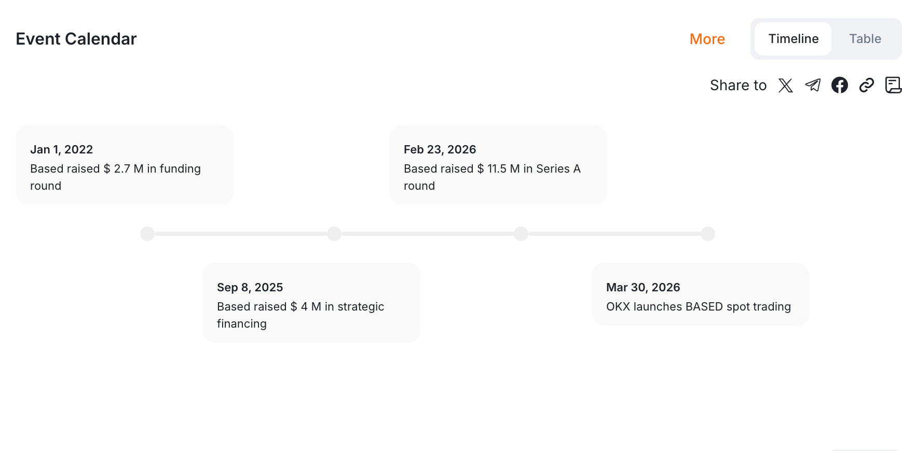

# ILITY 上币准备度差额分析与战略建议报告 (内部提交版)

ILITY 社交媒体及 PR 数据与主流交易所 (MEXC/Bitget) 上币要求的差距分析及优化方案

---

## 1. 核心指标对标概览

根据最新的上币要求 (listingRequirements.md)，ILITY 目前的核心指标存在一定缺口，具体对比如下：

| 维度                     | 当前数据 (ility_xyz) | 交易所要求                | 缺口状态                     | 对策                           |
| :----------------------- | :------------------- | :------------------------ | :--------------------------- | :----------------------------- |
| **Twitter 粉丝数** | ~10,000              | 50,000+                   | **较大缺口 (-400%)**   | 切换至 @ILITYfndn (56k)        |
| **Discord 成员数** | ~10,000              | 20,000+                   | **中等缺口 (-100%)**   | 投放加粉 & 尼日利亚团队活跃    |
| **PR & RootData**  | 数据缺失/过时        | 需媒体 PR & 更新 RootData | **关键缺口 (Missing)** | 媒体宣发后在 RootData 开票更新 |

---

## 2. 社交媒体优化策略

### A. Twitter (X)：快速达成 50k+ 粉丝目标

目前主账号 `@ility_xyz` 虽然互动率表现非常出色，但粉丝基数仅为 10,000 左右，难以满足交易所对“社区规模”的硬性考核。

* **解决方案**: 我们已经成功收购并更名了 **`@ILITYfndn`** 账号（目前拥有 **56,000+ 真人粉丝**）。
* **当前状态**: 该账号的头像、Bio 及 Profile 已全部根据 ILITY 品牌视觉修改完毕，目前处于“待静默”状态。
* **下一步计划**: 等待 Justin 的正式指令后开始发推，届时我们的推特数据将瞬间从 10k 跳跃至 50k+。

### B. Discord：规模翻倍与活跃度保障

目前 Discord 成员数为 10,000，目标是将其提升至 20,000。

* **人数增长**: 我们通过加粉任务在短时间内将成员数拉升至 **20,000 以上，但是不建议现在加，建议在临近上所的时候加。**
* **活跃度维护**: 在临近 Listing 的关键节点，我们将调配**尼日利亚社区团队**增加人手进入 Discord 主频道参与互动。
* **目标**: 确保交易所审核员在进入服务器时，能看到高度集中的实时讨论和良好的互动比例。

---

## 3. PR 宣发与 RootData 数据对标

交易所极为看重项目的机构背书和投资背景（投资人信息、融资金额等）。目前 ILITY 在 RootData 上的数据尚待完善。

### 战略步骤

1. **媒体宣发**: 寻找加密媒体进行融资信息的 PR 宣发，形成媒体报道背书。
2. **RootData 开票**: 拿着 PR 链接前往 RootData 的官方 Discord 频道 (https://discord.com/invite/AeKsqq9738) 开票，要求其按照顶级项目的标准更新我们的页面。

### 参考标杆：以 "Based" 项目为例

以下是我们需要对标的 RootData 完善标准（基于 *Based* 项目的截图）：

#### A. 项目概览与团队展示 (Overview & Team)

我们要确保 Team 模块包含核心成员的详细信息，增加项目的信任度。

#### B. 融资详情与投资矩阵 (Fundraising & Details)

这是上币审核的核心重点，需要清晰展示投资轮次。

#### C. 相关新闻与事件日历 (Related News & Calendar)

通过媒体 PR 丰富新闻模块，展示项目的活跃节奏。

---
