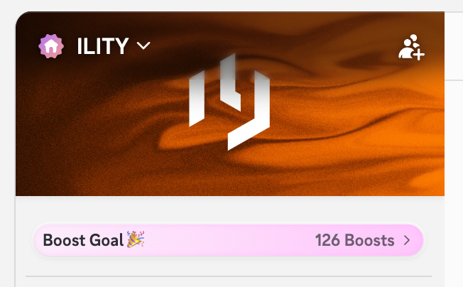
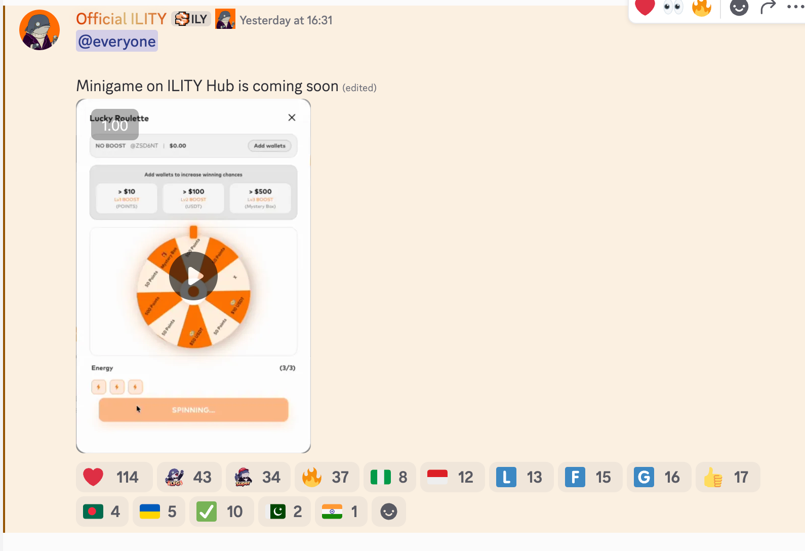
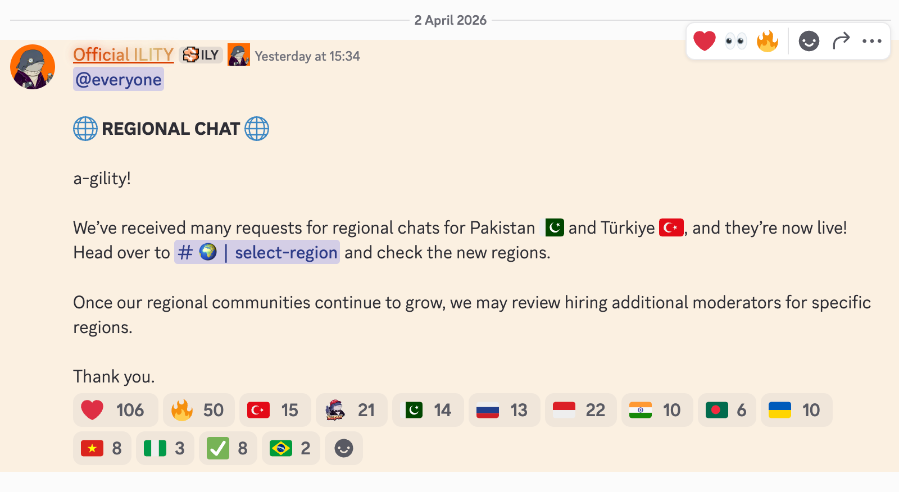
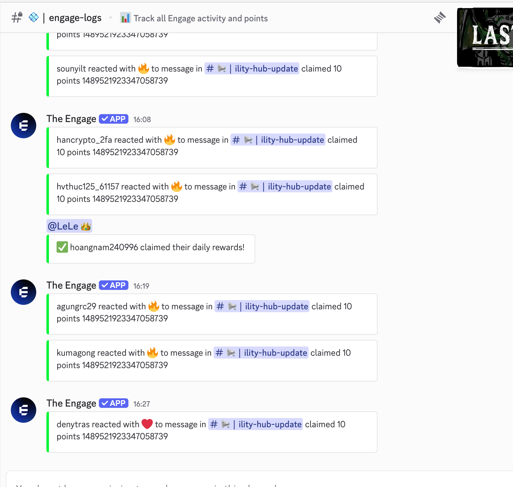
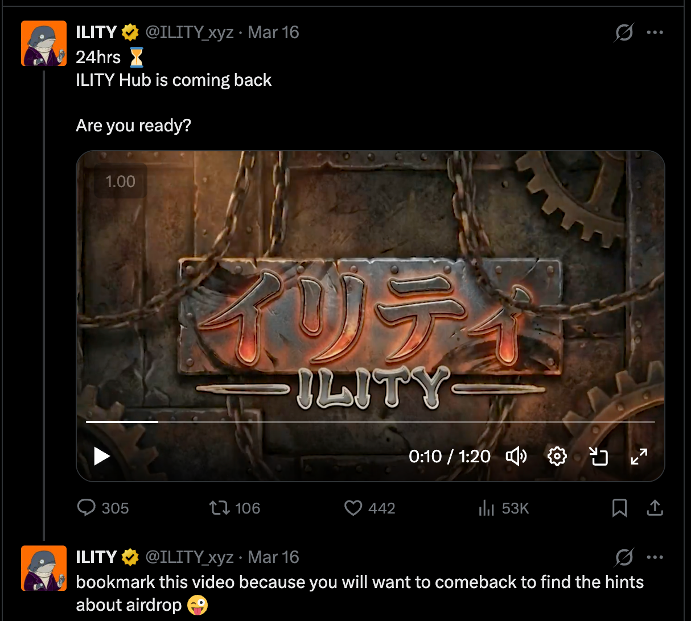

# ILITY 上币申请社交数据报告：基于 ZKP 的链上社交信号平台与社区活跃度分析

**日期**: 2026年4月3日
**对象**: MEXC & Bitget 上币审核委员会 (Listing Committee)
**项目定位**: The social platform for authentic crypto signal discovery | Onchain data meets human insight powered by ZKPs

---

## 1. 核心定位与用户价值分析

ILITY 是一个结合了零知识证明 (ZKP) 技术与人类洞察的链上信号发现平台。其核心价值在于通过技术手段过滤社交噪音，提取真实的链上交易信号。

*   **技术框架**: 利用 ZKP 在保护隐私的前提下验证用户链上行为。
*   **用户构成**: 平台主要吸引活跃的链上交易者和深度投资者，这类用户群体具有较高的交易频率和资产净值。
*   **生态价值**: 对交易平台而言，ILITY 的用户代表了高质量的存量及增量交易力量。

---

## 2. Discord 社区数据解析：参与深度与资源投入

ILITY 的 Discord 社区不仅在规模上有所沉淀，在用户参与深度和对服务器的资源投入上也表现出明确的数据特征。

### A. 用户规模指标

*   **数据**: 10,000+ Verified Members。
*   **分析**: 该基数通过了基本的社交身份验证，为项目提供了稳定的初始活跃群体。这些用户是 ILITY 生态的首批核心参与者。

### B. 服务器助力 (Boosts)：社群支持度的硬指标

*   **数据**: 126 Server Boosts，服务器目前处于 **Discord Tier 3 (最高等级)**。
*   **分析**: 126 个来自真实用户的点亮助力是一个关键的非工具化指标（Organic Indicator）。这表明社区成员愿意为维护服务器资源投入实际成本，是社群对项目长期支持意愿的体现。

### C. 互动频率解析 (Interaction Frequency)

*   **分析**: 
    - **互动密度**: 官方信息下方的 Emoji 反应数量呈现高比例分布，显示了用户对动态的持续关注。
    - **交流质量**: 聊天频道内记录了大量针对产品功能和链上信号发现逻辑的讨论，显示了用户对项目核心业务的理解。

---

## 3. Twitter (X) 触达数据：内容表现与用户互动率

ILITY 的 Twitter 运营专注于产品迭代和激励计划的精准触达。

### A. 核心账号粉丝走势

*   **数据**: **@ILITY_xyz**: 11,000+ 粉丝。
*   **分析**: 粉丝群体高度集中在 DeFi 和链上工具领域。1.1 万名粉丝是项目在功能开发阶段沉淀的核心粘性用户。

### B. 高互动内容表现分析 (Content Performance)

*   **分析**:
    - **内容触达**: 视觉化的产品展示和预告片在发布后获得了较高的交互数据（Likes/Retweets/Views）。
    - **行动转化**: 激励计划相关的推文互动数据证明了团队具备将社交曝光转化为用户实际操作动作的能力。

---

## 4. 结论：ITY 上线对交易所生态的潜在价值

ILITY 的社交数据展示了其作为优质资产的潜力：
1.  **用户质量**: ZK 信号发现的定位天然筛选出了偏好链上交易的高净值用户。
2.  **忠诚度验证**: 126 个 Boosts 提供了社群对项目长期投入的证据。
3.  **流量转换**: 社交互动数据证明了其具备持续吸引行业关注并进行转化的运营基础。

> [!IMPORTANT]
> **ILITY 的社区活跃度和资源投入度已达到上线主流交易所的标准。我们期待通过在 MEXC & Bitget 的上线，进一步扩大用户规模并提升交易活跃度。**
